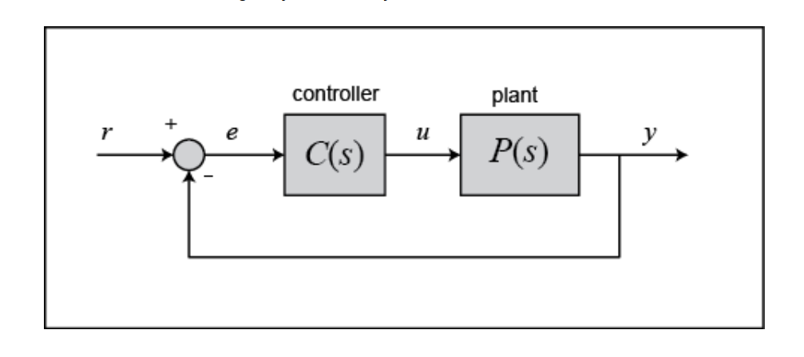
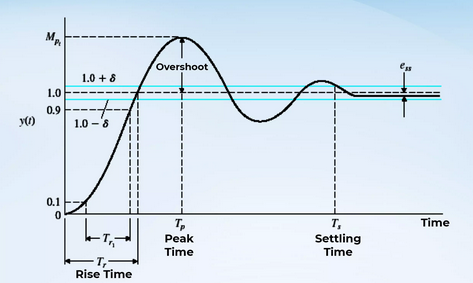

# PID Control

[A good article explaining PID](https://ctms.engin.umich.edu/CTMS/index.php?example=Introduction&section=ControlPID#1)

## Formulation

Given the below system:

Given that you have an error $e(t)$ defined as:

$$
e(t) = r(t) - y(t)
$$

Where:
- $r(t)$: Desired set point
- $y(t)$: measured process variable

The PID equation:

$$
u(t) = K_p e(t) + K_I \int^t_0 e(\tau)d\tau + K_D \frac{de(t)}{dt}
$$

In the laplace domain this becomes:

$$
U(s) = (K_P + \frac{K_I}{s} + K_D s)E(s)
$$

## Effects of gains
To see the effects the PID control, consider the below diagram:

| Gain                  | Rise Time         | Overshoot          | Settling Time                     | Steady-State Error                                | Intuitive Explanation                                                             |
| --------------------- | ----------------- | ------------------ | --------------------------------- | ------------------------------------------------- | --------------------------------------------------------------------------------- |
| **Proportional (Kp)** | ↓ (faster)        | ↑ (more overshoot) | Slight ↓ or ↑ (depends on system) | ↓ (improves, but not to zero for certain systems) | Stronger reaction to current error — makes system more aggressive and responsive. |
| **Integral (Ki)**     | ↓ (faster)        | ↑ (more overshoot) | ↑ (longer, may oscillate)         | ↓↓ (eliminates steady-state error)                | Accumulates past error — drives error to zero but can destabilize if too high.    |
| **Derivative (Kd)**   | Slight ↑ (slower) | ↓ (less overshoot) | ↓ (faster damping)                | No direct effect                                  | Reacts to error rate — anticipates motion, adds damping, smooths oscillations.    |
