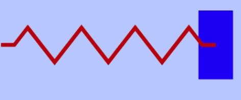
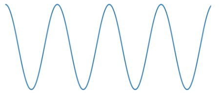
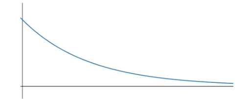
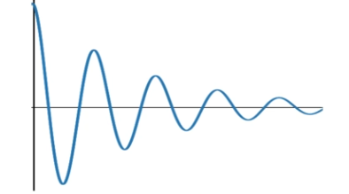
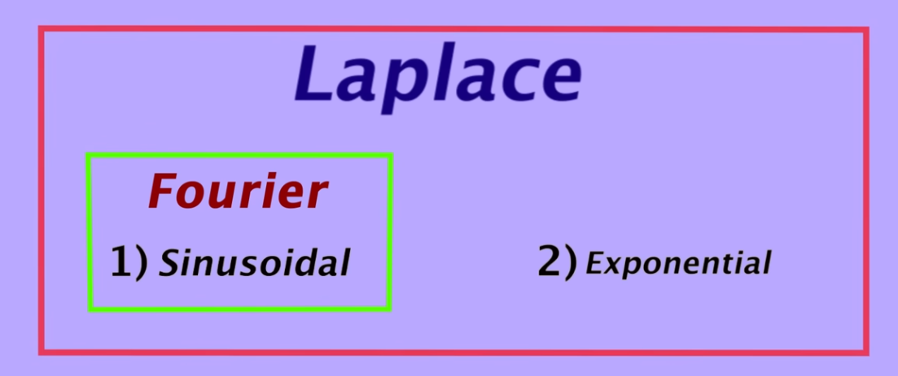
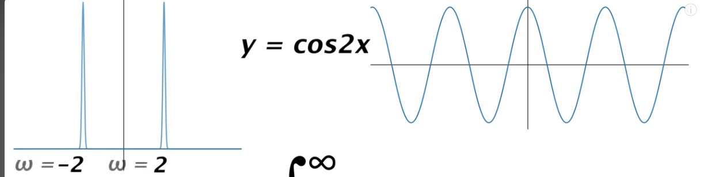
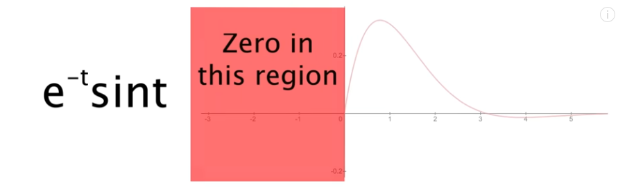
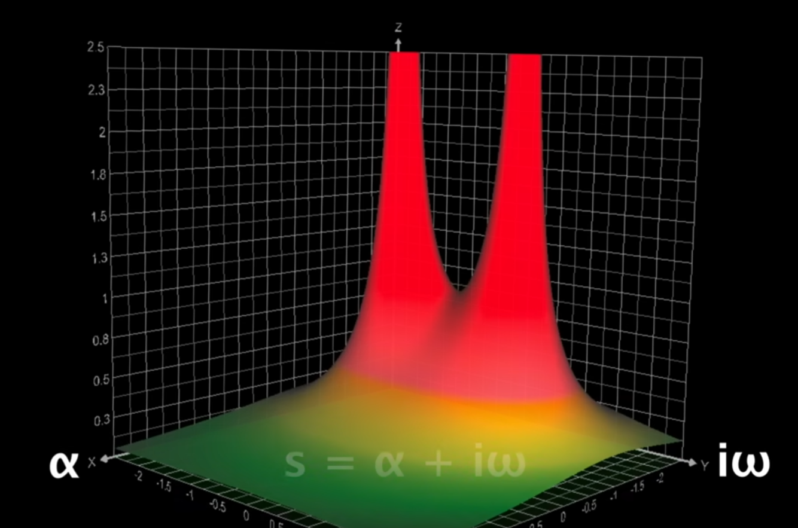
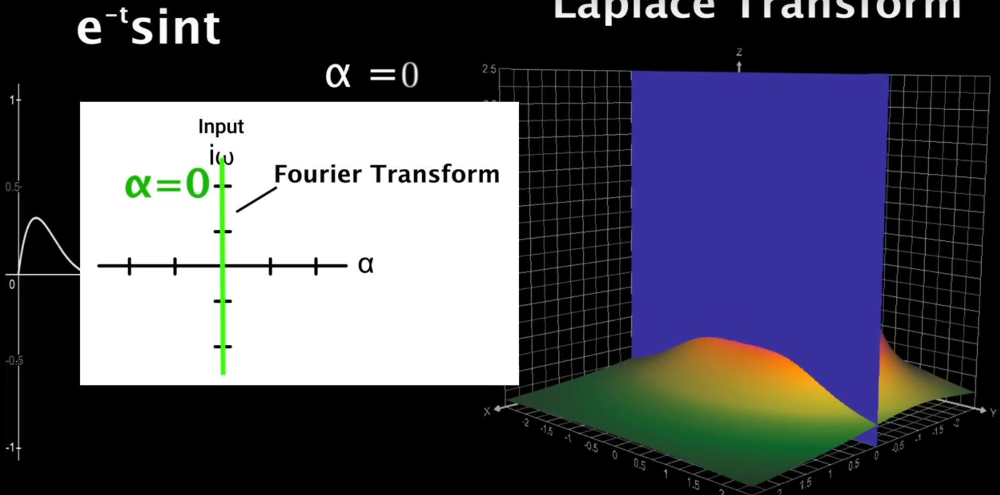

# Fourier & Laplace Transforms

See below video that gives an intuitive explanation of the Fourier and Laplace Transforms.

Credit for the information on this page is from the following YouTube video.
<iframe width="560" height="315" src="https://www.youtube.com/embed/n2y7n6jw5d0?si=dH-vA0cHOymAKpyc" title="YouTube video player" frameborder="0" allow="accelerometer; autoplay; clipboard-write; encrypted-media; gyroscope; picture-in-picture; web-share" referrerpolicy="strict-origin-when-cross-origin" allowfullscreen></iframe>

## Intro
Let's consider a damped mass system:

If the system is not damped, it will exhibit a sinusoidal motion:

If the system is damped, it will exhibit either:
1. Overdamped response:

2. Underdamped response:

Hence the system must have:
1. A sinusoidal component (represents the oscillations of the system).
2. An exponential decay component (represents the decay of the system energy as time passes).

Hence we have the following breakdown:

1. The **Fourier Transform** can be used to detect the sinusoidal components in the response.
2. The **Laplace Transform** can be used to detect both the exponential and sinusoidal components of the system.

## Fourier Transform

The fourier transforms is in a sense a way to find out what frequencies exist in a signal. It is defined as:

$$
X(\omega)=\int_{-\infty}^{\infty}x(t)e^{-i\omega t}dt
$$

It is used to detect what frequencies exist in the response.

Since you could see $e^{-i\omega t}$ which is euler's formula in the integral, which depicts rotations in the complex plane, where $\omega$ is the frequency of the rotation. Hence, only $\omega$'s that match frequencies embedded in $x(t)$ will maximize the value of this integral, and it will cause a spike in $X(\omega)$.

So in simple terms, you could think of the fourier transform as a scan across all values of $\omega$, and only $\omega$'s that match a frequency in the signal in $x(t)$ will cause a spike in the transform.

For example, in the above image we have a signal that has a frequency of 2 on the right, hence we see a spike in the fourier transform on the left at the values of 2 and -2.

## Laplace Transform

Similar to the fourier transform, however it tries to detect both the frequencies as well as the exponential decay in the signal.

The Laplace transform is defined as:

$$
X(s) = \int_{0}^{\infty} x(t)e^{-st}dt
$$

The first thing to notice is that we start the integral from 0, that because typically in the domain where Laplace is used, we only care about $t \geq 0$, hence it doesn't make sense to start integrating from the negative infinity.

Also, $s$ is a complex number, so we could:

$$
s = \alpha + i \omega
$$

Substituting back into the laplace formula we get:

$$
X(s) = \int_{0}^{\infty} x(t)e^{-at}e^{-i\omega t}dt
$$

Notice how we now have 2 exponential terms in the integral:
1. $e^{-at}$: This attempts to detect the exponential decay of the system, when $\alpha$ matches the same value as the exponential decay factor in the input signal, then the laplace transform is maximized.
2. $e^{-i\omega t}$: Similar to the fourier transform, this attempts to detect the frequencies in the system. When $\omega$ matches a frequency in the signal, then the laplace transform is maximized.

Let's pick an example that emphasizes this, let's pick a system where:

$$
x(t) = e^{-t}sin(t)
$$

The signal looks like this in the time domain:

Notice how there is a sinusoidal as well as an exponential decay component in that signal. Taking the laplace transform of this function:

Below is the plot of $X(s)$ for different pairs of $\alpha$ and $\omega$:

The 2 peaks in the above diagram are known as the **poles**.

Notice that the fourier transform is the slice of the laplace transform, it is basically the sliced plane at $\alpha = 0$

