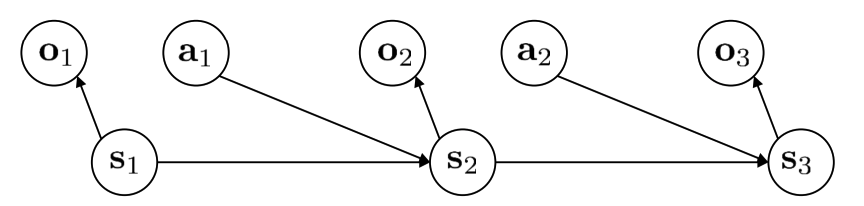
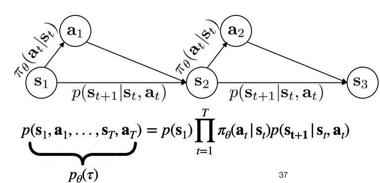

# Intro to RL

Notes from the [Deep Reinforcement Learning Course](https://www.youtube.com/watch?v=EvHRQhMX7_w&list=PLoROMvodv4rPwxE0ONYRa_itZFdaKCylL&index=1), lecture slides can be found [here](https://cs224r.stanford.edu/slides/01_cs224r_intro_2025.pdf).

## Quick Recap on RL

Why RL?
- No direct supervision available (or expensive to get)
- With supervised learning, system can't autonomously get better, the system can't learn from experience
- With supervised learning, we make the assumption that data is individually and identically distributed, with RL we don't make this assumption (current action is conditioned on the previous action).

How do we represent experience as data, we model it using the following representations:
- $s_t$: state of the world at time t
- $o_t$: What the agent observes at time t
- $a_t$: The decision taken at time t
- $\tau$: The trajectory of the agent in the environment

$$
\tau = (s_1, a_1, s_2, a_2, ..., s_T)
$$

- $r(s,a)$: The reward at state $s$ and action $a$ (how good is being at this state is and taking action a). Note, the reward being a function of the state is intuitive, however, it being a function of the action can be confusing. The reward is a function of the action because we may want to penalize or reward some actions at given states, for example we may want to penalize actions that spend to much energy which may be undesirable.

What is the difference between states and observations?

*Image from [course slides](https://cs224r.stanford.edu/slides/01_cs224r_intro_2025.pdf)*

In the above diagram, states are markov, they exhibit the markov property, meaning that any state $s_{t+1}$ only depends on the previous state $s_t$ and the action taken $a_t$, and it is independent of $s_{t-1}$ or prior states, or in other words:

$$
p(s_{t+1} | s_t, a_t)
$$

States may not be fully observable, i.e. the agent may not be able to observe the full markov state. Hence, we have observations which is a partial and potentially noisy representation of the environment. The observations don't hold the markov assumption, hence a history of the observations is typically stored by the agent to make decisions about the future.

So now we could ask, what is the goal of RL?

The goal is to find a policy $\pi_\theta (a_t | s_t)$ is to maximize the expected sum of rewards:

$$
\max_\theta \mathbb{E}_{\tau \rightarrow p_\theta(\tau)} \sum_t^Tr(r_t, a_t)
$$

We could visualize the entire process using this diagram:

*Image from [course slides](https://cs224r.stanford.edu/slides/01_cs224r_intro_2025.pdf)*

Why is it important to consider stochastic policies?
 - Exploration: Try different things
 - Model stochastic behavior: The underlying behavior may be stochastic

The next question becomes, how good is a particular policy?
- $V^\pi(s)$: The value function, it tells you the expected future reward you expect to get from a state $s$ following a policy $\pi$.
- $Q^\pi(s, a)$: Future expected reward starting at $s$, taking $a$, then following $\pi$.

## Types of RL Algorithms

1. **Imitation Learning**: mimic a policy that achieves high reward (just copy the expert).
2. **Policy gradients**: Directly differentiate the objective to improve the policy.
3. **Value-based**: Estimate the value of the optimal policy
4. **Model-based**: learn to model the dynamics, and use it for planning and policy improvement.

