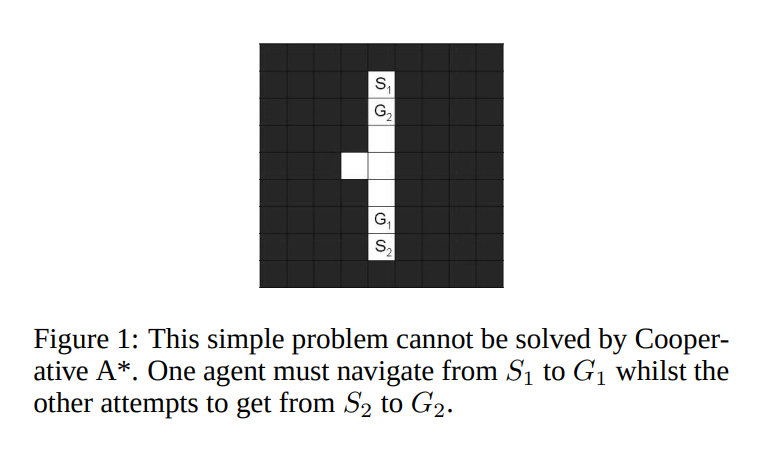

# Popular Prioritized Planning Algorithms

This page explains all the methods in [this paper](https://cdn.aaai.org/ojs/18726/18726-52-22369-1-10-20210928.pdf) written by [David Silver](https://en.wikipedia.org/wiki/David_Silver_(computer_scientist)) a prominent name in the field of Reinforcement learning.

It introduces the following three algorithms:
1. Local Repair A* (LRA*)
2. Cooperative A* (CA*)
3. Hierarchical Cooperative A* (HCA*)
4. Windowed Hierarchical Cooperative A* (WHCA*)

All of these algorithms are distributed.

## Local repair A* (LRA*)

This algorithms works by:
1. Each agent planning their path in space using A* ignoring all other agents
2. If an agent encounters a collision with another agent, the path is locally repaired by replanning with A* just to avoid the local collision

This method is of course not optimal, and is prone to cycles and deadlocks.

## Cooperative A* (CA*)

This is the classic Prioritized Planning example, where agents are ranked with priorities, highest priority agent plans its path first, then lower priority agents plan their paths avoiding collisions with higher priority agents. The search is down in 3D space (x,y,t), hence we're adding an extra dimension of time, which increases the complexity of the problem, and increases the branching factor of the algorithm.

This method is not complete and here is an example in the paper where this method would completely fail:

Typically, for guiding the A* search, the manhattan distance is used as the heuristic, which is not great and can cause the search to be inefficient. Hence, we need a better heuristic, which is introduced in the next section.

## Hierarchical Cooperative A* (HCA*)

The HCA* algorithm is just an improvement over the CA* algorithm, specifically it improves the heuristic used in the A* search.

Instead of just using the manhattan distance heuristic, HCA* uses a different heuristic which:
1. Ignores the time domain
2. Computes the path to goal using RRA*, this will be the geometric path to the goal ignoring conflicts with other agents. It is an admissible and consistent heuristic since it always underestimates the cost to goal. That's because the heuristic represents the perfect cost if the robot doesn't encounter any more conflicts with other agents in the future, so at best the cost to goal will be equal to the heuristic. However, if the agent actually encounters other obstacles. Then it would have to replan or wait, increasing the cost making it larger than the heuristic. Hence, the heuristic must be admissible.
3. The heuristic is calculated using RRA*, which is reversed A* (i.e. we plan from goal to start) with the ability to resume the search. It is meant to cut down on the amount of computation every time we need to calculate the heuristic, since the A* graph is not thrown away between heuristic computations (it is re-used). Also, since the search is reversed, simply the value of the cost at any node will be exactly the cost to the goal.

This method again is a copy of CA* but with an improved heuristic.

## Windowed Hierarchical Cooperative A* (WHCA*)

There are three problems with the above approaches:

1. Agents terminate when they reach their goal. This means that if the agent is at its goal, and is blocking the progress of another agent, it cannot move out of the way. This is suboptimal.
2. Sensitivity to agent ordering. It may be possible to statically assign the agent ordering for all agents. However, in most scenarios this is infeasible and in-effective. The order of the agents impacts the effectiveness of the algorithm, hence agents must be able to dynamically change their priorities for the algorithm to be effective.
3. The previous algorithms must compute the entire path in 3D space (x,y,t) which is highly expensive and costly.

WHCA* overcomes the above issues by introducing a windowed search, where the 3D search is only performed for w steps in the future considering other agents, then after w steps, we just use the heuristic value to get the final cost to the goal. This makes the problem much less expensive to solve.
Also, at the goal the agent keeps repeating the step reacting to other agents if it needs to move out of the way.
Also, agents priorities are rotated to give each agent a chance to be the highest priority.
