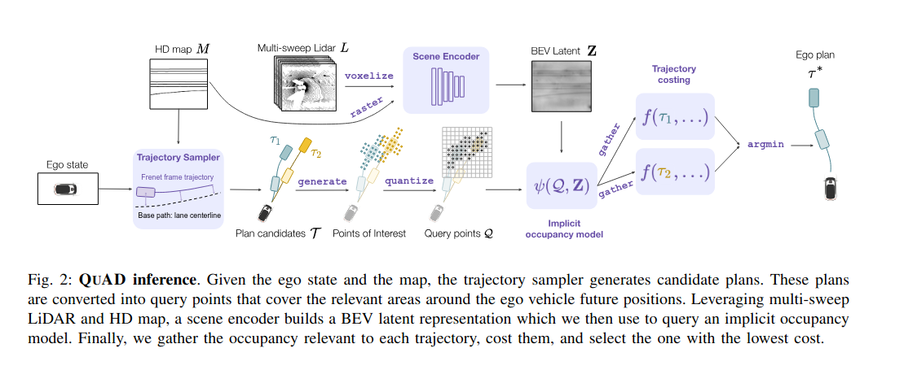

# Papers for Waabi and Uber ATG

## QuAD: Query-based Interpretable Neural Motion Planning for Autonomous Driving

Link to paper: https://arxiv.org/pdf/2404.01486?

The premise of the paper is breaking the typical paradigm of perception -> prediction -> planning, where information about the uncertainty between 

AI Summary:

QuAD offers a fresh, conceptually clean paradigm for motion planning in autonomous driving: move from constructing full-blown representations of the world to querying only what matters. The explicit occupancy queries + cost decomposition yield interpretability, and computational efficiency is improved by avoiding dense predictions.

If this idea scales well to real-world, dense, highly interactive driving scenarios (urban streets, pedestrians, occlusions, rare events), it could shift how we design perception/prediction/planning systems. The approach elegantly balances between too much precomputation (dense maps) and too little structure (end-to-end black box).

If you like, I can dig into the experimental results, ablation studies, or possible extensions. Do you want me to do that?

These are the cost factors: safety, comfort, and progress.

https://openaccess.thecvf.com/content_CVPR_2019/papers/Zeng_End-To-End_Interpretable_Neural_Motion_Planner_CVPR_2019_paper.pdf

We then utilize a Clothoid curve, also known as Euler
spiral or Cornu spiral, to represent the 2D path of the SDV
[28]. We refer the reader to Fig. 2 for an illustration. The
curvature κ of a point on this curve is proportional to its
distance ξ alone the curve from the reference point, i.e.,
κ(ξ) = πξ. Considering the bicycle model, this linear curvature characteristic corresponds to steering the front wheel
angle with constant angular velocity. The canonical form of
a Clothoid can be defined as

The probability of using straightline, circle and Clothoid curves are 0.5, 0.25, 0.25 respectively. 

 In addition, we sample constant accelerations ¨ξ ranging from −5m/s2
to 5m/s2 which
specifies the SDV’s velocity profile.

